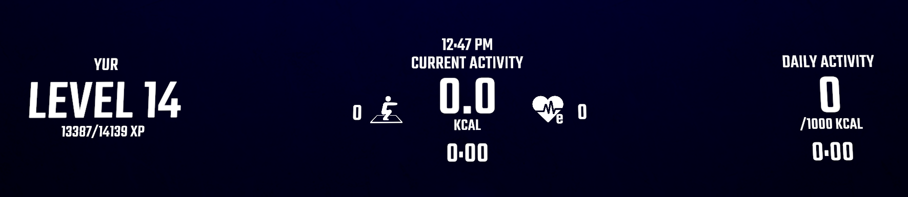
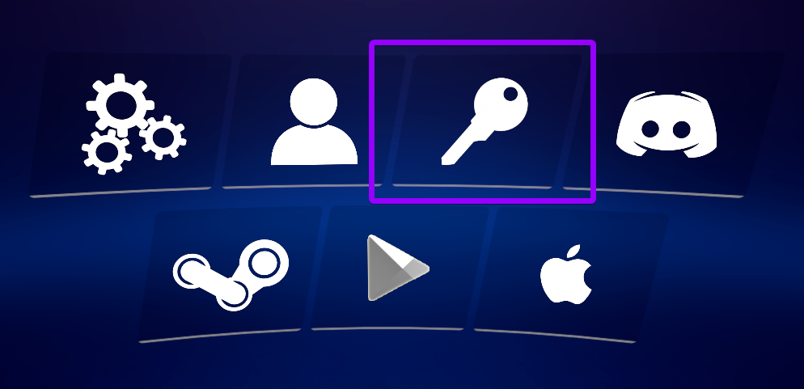
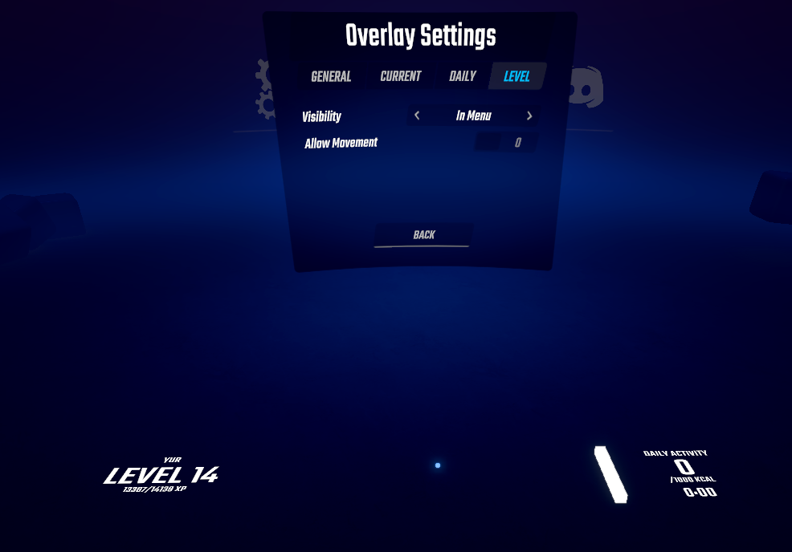

This repository doesn't contain any code or builds, and is simply third-party documentation.
# YUR Fit Calorie Tracker
##### Track YUR calories while playing Beat Saber!

---

## Features
- Tracks calories burnt in each map/difficulty and in the menu
- Displays your current progression, experience points, calories burned, and other statistics as an in-game overlay
- Connects to the YUR Steam app to automatically login to an existing YUR account
- Supports switching between multiple YUR accounts
- Uploads your fitness metrics, accessible on the YUR website or apps

## Installation
The latest release can be installed from [Mod Assistant](https://github.com/Assistant/ModAssistant).

## Usage

This mod requires a YUR account, which can be signed up for [here](https://app.yur.fit/login). By using this mod, you agree to the YUR Terms of Service and Privacy Policy, which can be found on the sign up page.

#### Automatic Login
If the YUR Steam app is running and logged in, the mod should automatically login to the current account and immediately display your statistics.

#### Manual Login
If the YUR Steam app is not running or installed, or an error occurred with automatic linking, you may see `YUR Not Logged In!` on the overlay.  
If so, open the settings in the Mods tab and click the Key button, then login using a temporary code, Google account, or email.

### Overlay Settings
You can choose to hide the entire overlay to let the mod track calories in the background, or adjust various settings about where each overlay is displayed, such as only in-menu or only in-game. Each overlay can also be moved, rearranged, or hidden.

## Data Usage and Privacy

#### Types of Data Collected
- Email address
- First Name and Last Name
- Date Of Birth
- Gender
- Height
- Weight
- Usage Data

#### Access, Portability, and Deletion
To exercise the access, data portability, and deletion rights described by CCPA or GDPR, please submit a verifiable [privacy data request](https://forms.gle/frpfKJFrXkj6X9bY7) or [deletion request](https://forms.gle/9LuyG9n7BHv2yhaM6) to YUR, or send an email to `privacy@yur.fit`.